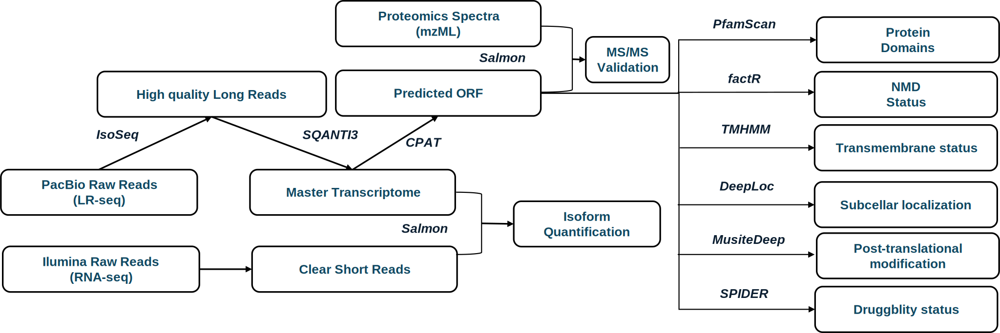

# isoseq2orf Pipeline

**isoseq2orf** is a pipeline designed to convert long-read sequencing data into a representative transcriptome for a specific cancer type and perform primary sequence characterization of novel open reading frames (ORFs).  
The workflow of the pipeline is illustrated below:

---

## 📌 Pipeline Overview

The pipeline consists of the following key steps:

1. **Convert raw sequencing data** (`000_ccs2gtf.sh`)
2. **Predict ORFs and perform quality control** (`001_gtf2orf.sh`)
3. **Quantify the master transcriptome using short-read RNA-seq** (`002_gtf2qnt.sh`)
4. **Validate predicted ORFs using MS/MS** (`003_orf2ms.sh`)

---

## 🛠 Pipeline Scripts

### 1️⃣ `000_ccs2gtf.sh`
**Function:**  
🔹 Converts raw data from the PacBio sequencer into the master transcriptome.

### 2️⃣ `001_gtf2orf.sh`
**Function:**  
🔹 Performs quality control (QC).  
🔹 Predicts open reading frames (ORFs).  
🔹 Conducts primary sequence characterization of the master transcriptome.

### 3️⃣ `002_gtf2qnt.sh`
**Function:**  
🔹 Quantifies the master transcriptome based on external short-read RNA-seq datasets.

### 4️⃣ `003_orf2ms.sh`
**Function:**  
🔹 Performs MS/MS validation of the predicted novel ORFs.

---

This pipeline enables comprehensive analysis of novel ORFs derived from long-read sequencing, integrating transcriptomic, proteomic, and functional data.
